# AIDeck

**把 Claude Code 的运行状态画在 macOS 桌面上。** 不切回终端，也知道哪个会话在跑、哪个在等你、额度还剩多少。

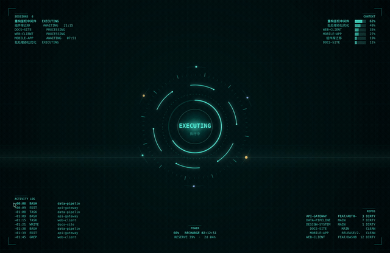

## 安装

[**下载最新版 DMG**](https://github.com/roc-zjp/AIDeck/releases/latest) → 拖进 Applications → 打开。

首次打开会提示「无法验证开发者」，这是因为应用还没有 Apple 的 Developer ID 签名。**右键点图标 → 打开 → 再次点「打开」**即可，只需一次。

<details>
<summary>或者从源码构建（需要 Xcode 命令行工具）</summary>

```bash
git clone https://github.com/roc-zjp/AIDeck.git
cd AIDeck/code/app
./build.sh && ./ld start
```

</details>

装好后它就常驻在菜单栏，没有 Dock 图标、没有主窗口。首次启动会弹一次使用说明。

## 你会看到什么

**桌面**上是一块随状态变化的画面。四个颜色贯穿所有主题：空闲深蓝青、思考中紫粉、执行工具青绿、**等你输入琥珀橙**。琥珀是唯一需要你「该我了」的颜色。

**菜单栏**是个彩色圆盘，带等待中的会话数，一直在。

**状态卡**是桌面上一张小卡片，列出所有会话和各自等了多久。平时它在桌面图标层，被窗口盖住；一旦有会话在等你输入，它会自动浮到所有窗口之上出现在眼前，你回复完自己缩回去。有会话在等时单击卡片，直接跳到对应的终端窗口。

**通知**兜底：等待超过阈值发一次（每次等待只发一次，不轰炸），额度跨 80% / 95% 各一次。点通知会唤起对应的终端。

桌面被窗口完全盖住时动画会**自动停止渲染**（实测 0fps），屏保、息屏、锁屏期间同样。连续 76 小时的运行数据里，动画实际在渲染的时间占 4.9%。

## 12 款主题

在设置窗口里点一下就能换，或者 `./ld next` 轮换。

| | |
|---|---|
| **JARVIS** 反应堆环 + 信息面板 | **Radar** 会话是回波点，离心距离 = 多久没输出 |
| **Matrix** 雨里混着真实的工具名和分支名 | **Globe** 每个会话一条绕球轨道 |
| **Circuit** 电子沿电路流动，工具调用炸出白热电子 | **Warp** 星场航速随状态，切换即跃迁 |
| **Hologram** 3D 投影台，可换成你自己的模型 | **Basketball** 数字人练干拔，commit 时庆祝 |
| **Bounce** 每次工具调用多一颗零重力弹球 | **Aurora / Neural / Pulse** 纯氛围，Pulse 最省电 |

<details>
<summary>展开看全部 12 款动图</summary>

Radar

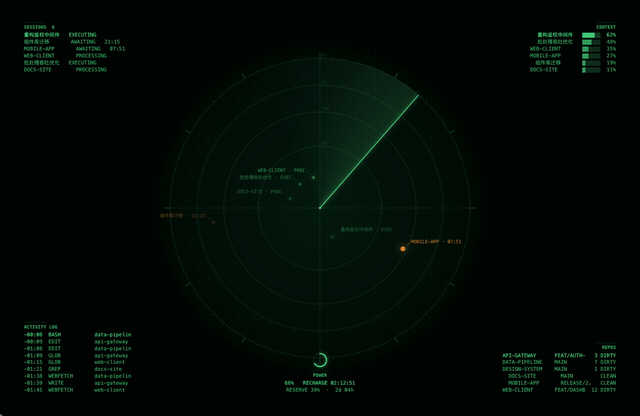

Basketball — 普通跳投 = 一个回合完成，庆祝动作 = 一次 git commit，记分牌上的 SCORE 是本次运行的真实 commit 数

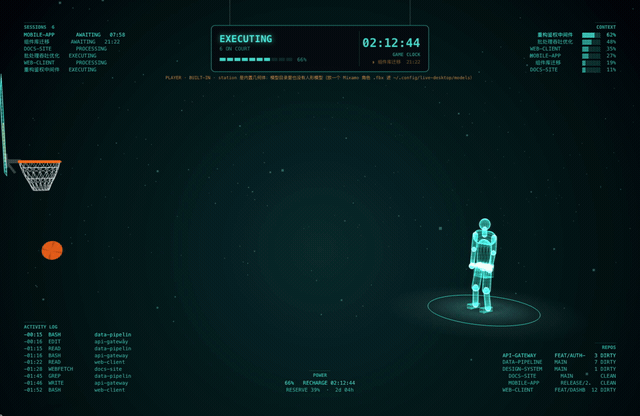

Matrix

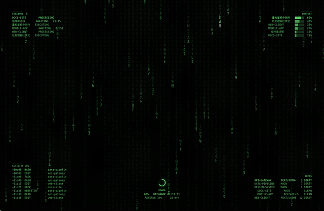

Hologram

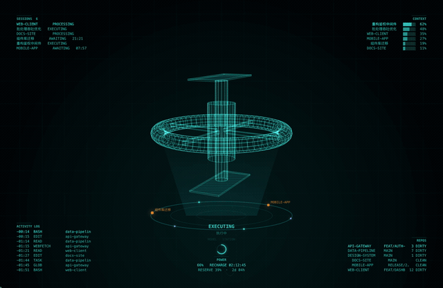

Globe

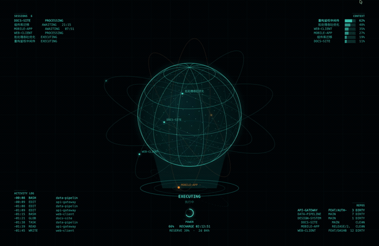

Circuit

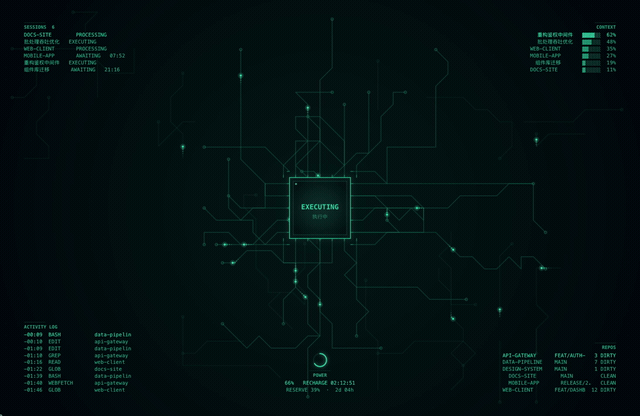

Warp

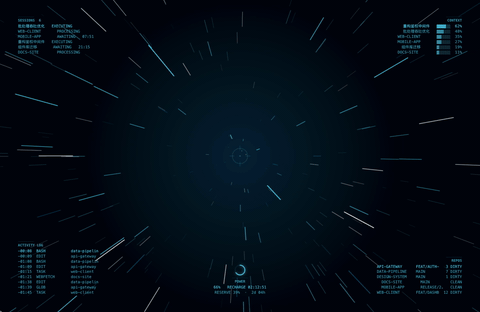

Bounce

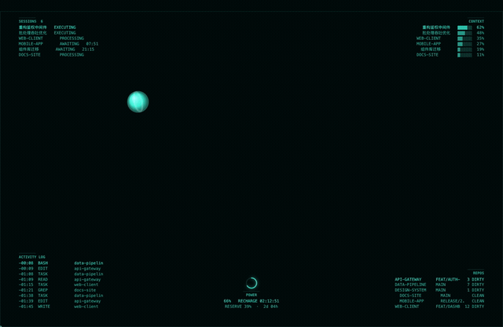

Aurora

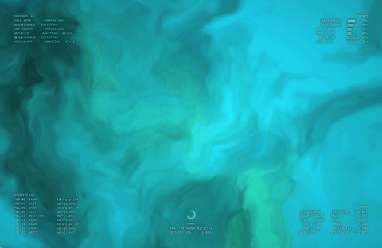

Neural

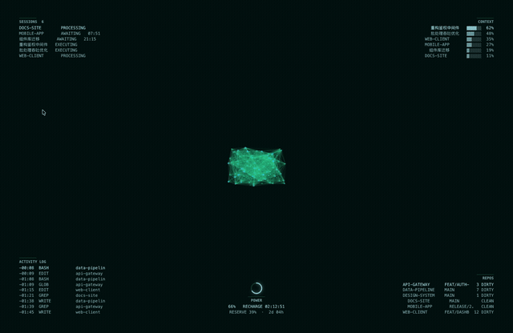

Pulse

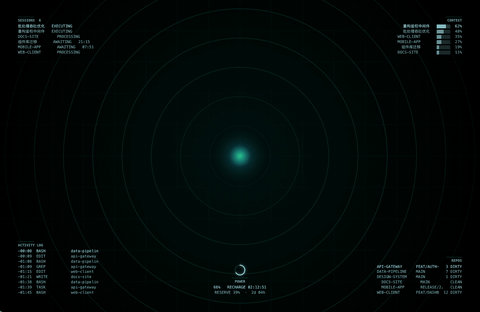

</details>

> 动图录自演示环境，画面里的会话名与项目名都是演示数据。

## 桌面四周的信息面板

九宫格里想放哪格自己拖，设置窗口里直接拖到预览上就行。七个可选面板：

- **SESSIONS** 所有会话：名字、状态、等了多久
- **CONTEXT** 每个会话的上下文占用，快满了意味着该收尾
- **ACTIVITY LOG** 最近的工具调用流水
- **REPOS** 活跃项目的分支与未提交文件数
- **POWER** 额度剩余与重置时间
- **SYSTEM** 整机 CPU / GPU / 内存 / 磁盘，外加 Claude 吃掉多少
- **SYSTEM TIME** 时钟与开机时长

这里所有数字都绑着真实数据源。读不到的指标整行不画（比如 GPU 读不到就没有那行），没有额度数据就整块面板消失——宁可留空，不补零也不估算。

## 它读你什么数据

这是个常驻桌面、读你 Claude 会话的工具，所以说清楚：

**只读两个地方**：`~/.claude/sessions/*.json`（Claude Code 的会话注册表，给出进程号、忙闲、会话名）和 `~/.claude/projects/**/*.jsonl`（会话记录，用来判断最后一条是谁说的、最近调了哪些工具）。**不读会话内容正文，不碰任何凭证，不联网。**

**只在你主动执行 `./ld quota on` 时写一处**：往 `~/.claude/settings.json` 的 `statusLine` 装一个透传小程序，它把 Claude Code 本来就会喂给状态栏的额度数字顺手记一份，再原样转给你原来的命令。改之前会整份备份，`./ld quota off` 一键恢复。不做这步的话额度面板就是空的，其余功能不受影响。

## 常用命令

设置窗口（菜单栏 → 设置，或右键状态卡）能点的都能点，命令行只是不依赖菜单栏的备用入口：

```bash
./ld start | stop | status | next     # 启停、换主题
./ld settings                         # 设置窗口，左侧是真实渲染的实时预览
./ld hud on | off                     # 状态卡显示 / 隐藏
./ld quota on | off | status          # 额度数据源接入 / 恢复
./ld autostart on                     # 开机自启
```

## 常见问题

**首次打开提示「无法验证开发者」** — 右键图标 → 打开 → 再点「打开」。应用目前只有 ad-hoc 签名，正式签名需要 Apple Developer ID。

**菜单栏找不到图标** — 刘海屏上图标一多会被系统静默隐藏。**右键桌面上的状态卡**是永远可用的设置入口，或者用 `./ld settings`。

**桌面看不到动画** — 动画在桌面图标层之下，需要桌面本身露出来才看得见（窗口全盖住时它也会停止渲染省电）。

**会不会很耗电** — 被遮挡时不渲染，实测 0fps。长期均值 4.9%。想更省选 Pulse 主题。

## 自己写一款主题

一款主题就是一个自包含的 HTML，丢进 `~/.config/live-desktop/skins/` 就能在设置里选到（设置页可以一键从模板新建）。

宿主给页面三个方法：`setState` 推每秒一拍的状态，`setConfig` 推偏好，`setRunning` 是渲染闸门。主题还能自己声明设置项，宿主按 schema 自动渲染出控件：

```js
__ld.declarePrefs([
  { id: 'gravity',  name: '重力',     type: 'bool',   default: false },
  { id: 'maxBalls', name: '球数上限', type: 'number', default: 12, min: 1, max: 30 },
]);
```

新建主题时皮肤目录会自动生成一份完整的契约说明，照着 `pulse.html`（最短的模板）改最省事。

## License

MIT，见 [LICENSE](LICENSE)。随仓库分发的 Three.js 与 Draco 按其各自许可证提供，见 [THIRD-PARTY.md](code/app/Resources/web/THIRD-PARTY.md)。
